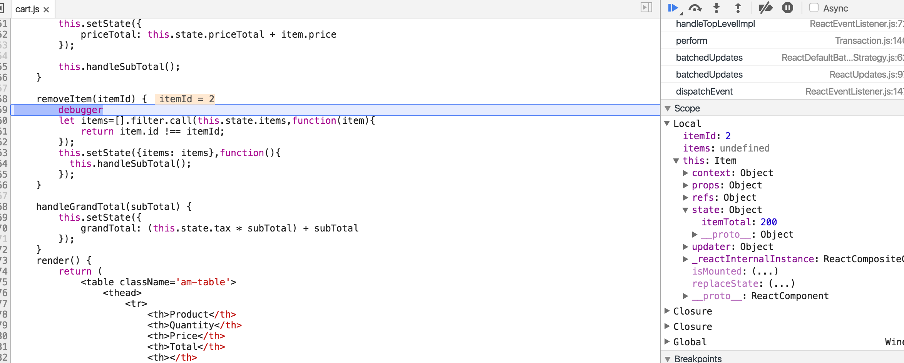
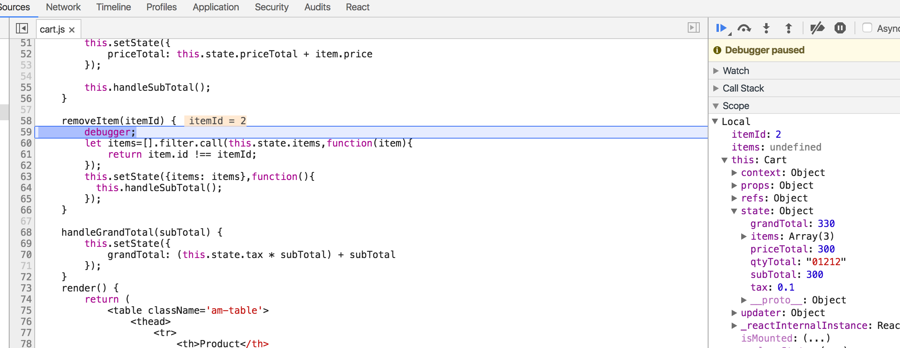

# Cart 购物车实例

## Start

开启mock api接口 和 启动程序
```
npm run mock
npm run start
```

## 购物车 简单介绍

Cart主要包括`<Item />` & `<List />`两个组件。

### 根组件

```javascript
// 继承Component类
export default class Cart extends Component {
    constructor(props) {
        super(props);
    // this.state 用于存储数据
        this.state = {
            items: [],
            qtyTotal: 0,
            priceTotal: 0,
            subTotal: 0,
            tax: 0.10,
            grandTotal: 0
        }
    }
    // 使用 componentDidMount 在组件初始化后执行一些操作
    componentDidMount() {
        this.initData();
        this.handleSubTotal();
    }
  
    initData(){
        // 使用 [faker.js]() 产生模拟数据
        // 选择轻量的axios 获取api接口，代替传统的jquery
        axios.get(`http://localhost:9999/cartItems`)
            .then(result => {
                // 使用 setState 更新组件数据
                this.setState({ items:result.data });
            }).catch(result=>{
                console.log(result);
            });
    }
    removeItem(itemId) {
        let items=[].filter.call(this.state.items,function(item){
            return item.id !== itemId;
        });
        //  这里在 setState的回调函数中执行 this.handleSubTotal()，避免setState的延迟导致数据错误
        this.setState({items: items},function(){
            this.handleSubTotal();
        });  
    }
    // ... 省略其他方法的实现，详细看demo源代码
    render(){
        return (
            // ... 省略
            // 使用 <List />组件，传递属性
             <List
                    items={this.state.items} removeItem={this.removeItem.bind(this)} changeQty={this.changeQty.bind(this)} 
                    handleSubTotal={this.handleGrandTotal.bind(this)}/> 
                    // ⚠️注意⚠️：这里使用bind(this)绑定上下文。
            // ... 省略                    
        )
    }
}
```
* 关于`this`还是需要再梳理一下：首先，new一下我们定义的类，调用`constructor()`函数,`this.state`的`this`就是实例对象，同理，`render()`的`this.state`的`this`也是该实例对象。主要是方法中的`this`。在ES5写法的`createClass`中，Facebook的ES6创建组件的方法(extends Component)取消了自动绑定this,所以我们需要使用`bind(this)`来绑定上下文，才能够正确的执行方法中的`this.state`（笔者认为：如果我们不绑定 this 上下文，那么当我们将该方法作为属性传递个子组件的时候，this的上下文便会是子组件，于是便无法正常访问父组件的this.state）

比如：
```javascript
 removeItem(itemId) {
        let items=[].filter.call(this.state.items,function(item){
            return item.id !== itemId;
        });
        //  这里在 setState的回调函数中执行 this.handleSubTotal()，避免setState的延迟导致数据错误
        this.setState({items: items},function(){
            this.handleSubTotal();
        });  
    }
// ........
 <List
        items={this.state.items} removeItem={this.removeItem} changeQty={this.changeQty.bind(this)} 
        handleSubTotal={this.handleGrandTotal.bind(this)}/> 
```
这里，removeItem不绑定this上下文，那么子组件执行该方法时候，便会因为不存在`this.state.items`而报错 


